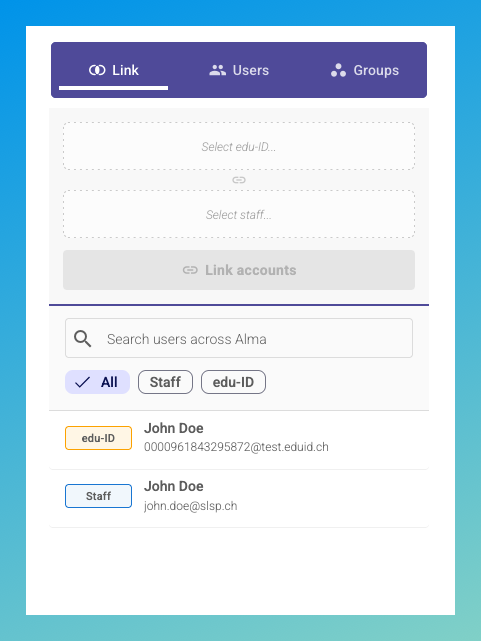
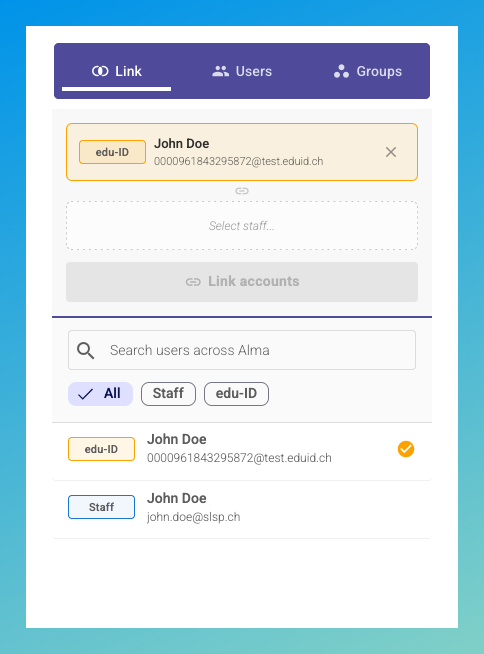
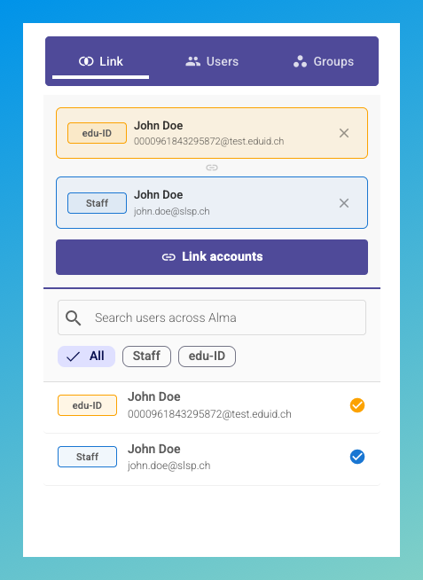
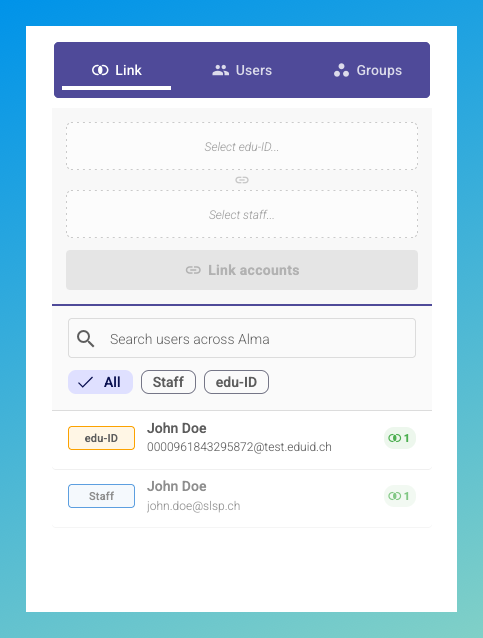
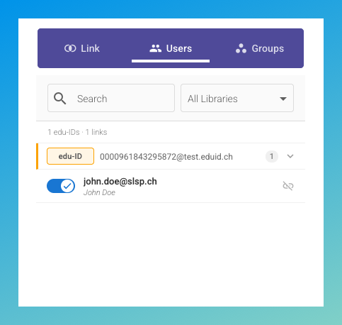

# SLSP Staff

Alma Cloud App for managing staff user accounts and their Switch edu-ID links across SLSP institutions.

## Overview

- **Link** Alma staff accounts with Switch edu-ID for MFA-compliant authentication
- **View** all staff users and their edu-ID link status (IZ admin overview)
- **Filter** by library code, user type (staff / edu-ID), and link status

## Requirements

- Institution must be part of the SLSP network zone
- Institution must be activated by SLSP
- User requires the **User Manager** Alma role

## Tabs

### Link

Link the current Alma staff user to their Switch edu-ID account. This enables authentication with edu-ID credentials, providing MFA and improved security.

### Users

Overview of all staff users across your institution and their edu-ID link status. Filter by user or library and view summary statistics for total users and linked accounts.

### Groups

Group management (coming soon).

## Screenshots

### Link Tab

Search and filter users from Alma. Select an edu-ID account and a staff account to link them together. The users currently open in the Alma main UI are pre-loaded for convenience. Use the search bar to find other users.

Select the edu-ID account to place it in the upper slot.

Select the staff account to place it in the lower slot. With both accounts selected, confirm the link to create it in the backend.

After linking, a badge shows the active link count for each user.

### Users Tab

Admin overview of all staff users and their edu-ID link status. Filter by name or library.

## Support

Report issues: https://github.com/Swiss-Library-Service-Platform/slsp-staff-cloud-app/issues

## License

GPL-3.0 — see [LICENCE](LICENCE)
